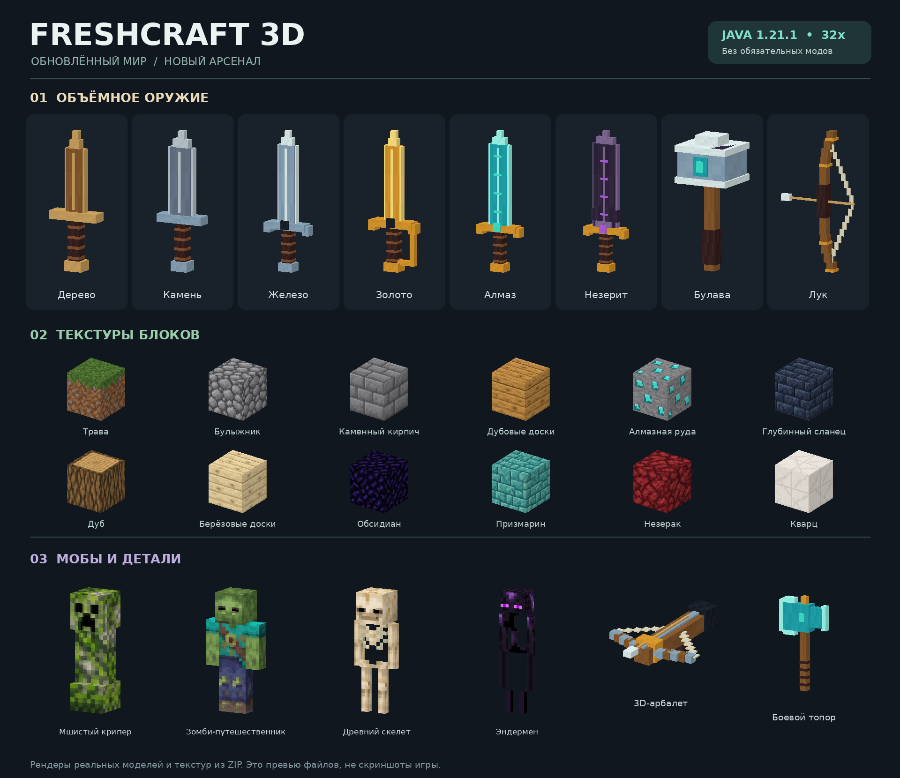

# Minecraft Builds

Готовые материалы и проекты для Minecraft Java 1.21.1:

## 1. Chunk Loader — Minecraft Java 1.21.1

Для Java 1.21.1 используется загрузчик чанков через связанные Nether-порталы. Перемещение сущности через портал временно загружает чанки на другой стороне; механизм должен регулярно повторять переход.

Проверенный item-based вариант для Java 1.19–1.21.4:
https://www.shulkr.com/en/schematics/aSuzSliQaedl/item-nether-portal-chunk-loader

Для 1.21.1 после выгрузки/перезапуска мира такой загрузчик может потребовать повторного запуска.

## 2. Royal Rags — Texture Pack 1.21.1

Файл:
- `Royal_Rags_1.21.1.zip`

Все старые дома, фермы железа, ферма криперов и тестовые схемы удалены из текущей ветки.

## 3. FreshCraft 3D — Resource Pack 1.21.1

[**Скачать готовый ресурс-пак ZIP**](FreshCraft_3D_1.21.1.zip?raw=true) · [Открыть превью](FreshCraft_3D_preview.jpg)

- 157 обновлённых текстур блоков в разрешении 32×32.
- Обновлённый внешний вид 16 видов мобов.
- 33 объёмных предмета: мечи, топоры, кирки, лопаты, мотыги, лук, арбалет и булава.
- Сохранены стадии натяжения лука и зарядки арбалета.
- Для Minecraft **Java 1.21.1**, формат ресурс-пака **34**. Дополнительные моды не требуются.

**Установка:** положить `FreshCraft_3D_1.21.1.zip` целиком в папку `resourcepacks` своей сборки, не распаковывать. Затем включить через «Настройки → Наборы ресурсов». Если есть другие паки, поставить FreshCraft выше тех, чей внешний вид нужно заменить.

Изменён внешний вид; урон, прочность и поведение предметов остаются стандартными. Обновлена часть материалов и мобов, остальные ресурсы берутся из Minecraft.

Проверены структура ZIP, пути и размеры текстур, прозрачность скинов, JSON-модели и состояния оружия. Запуск внутри игрового клиента не проверялся. Превью собрано из моделей и текстур пака и не является скриншотом игры.

